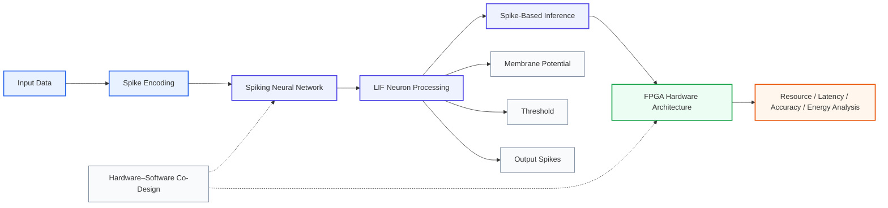

# Energy-Efficient FPGA SNN

**Research project on energy-efficient FPGA architectures for Spiking Neural Network (SNN) inference.**

This project explores how brain-inspired neural computation can be mapped onto FPGA hardware with an emphasis on **resource efficiency, latency, inference accuracy, and energy-aware architecture design**.

## 🔬 Research Question

> How can a Spiking Neural Network inference architecture be implemented and optimized on an FPGA to reduce hardware resource utilization and energy consumption while maintaining acceptable inference accuracy?

## 🧠 Research Focus

* Spiking Neural Networks (SNNs)
* Neuromorphic Computing
* FPGA-Based AI Hardware
* Energy-Efficient Computing
* Hardware–Software Co-Design
* Low-Power AI Accelerators
* Edge Intelligence

## ⚙️ Technical Direction

The project investigates the hardware-oriented implementation of SNN inference, including:

* SNN neuron computation
* Leaky Integrate-and-Fire (LIF) neuron models
* Spike-based information processing
* FPGA-oriented digital architectures
* Hardware resource optimization
* Latency-aware architecture design
* Energy-efficient computation

## 🧩 Interactive SNN Demonstration

An interactive software demonstration is available through Hugging Face:

**[🧠 Launch the Neuromorphic Computing Demo](https://huggingface.co/spaces/WajeehaUmar/neuromorphic-computing-demo)**

The demonstration provides a visualization of **LIF neuron dynamics**, including membrane potential, threshold behavior, and output spike generation.

The software demonstration complements the FPGA research by providing an accessible representation of the underlying SNN computational model.

## 🏗️ Research Architecture

The intended research flow is:

```text
Input Data
    ↓
Spike Encoding
    ↓
Spiking Neural Network
    ↓
LIF Neuron Processing
    ↓
Spike-Based Inference
    ↓
FPGA Hardware Architecture
    ↓
Resource / Latency / Accuracy / Energy Analysis
```


## 🏗️ Research Architecture

The proposed research architecture follows the pipeline below:




## 📊 Evaluation Objectives

The research is oriented toward evaluating SNN implementations using:

| Metric         | Research Objective                        |
| -------------- | ----------------------------------------- |
| FPGA Resources | Reduce hardware utilization               |
| Latency        | Improve inference efficiency              |
| Accuracy       | Maintain acceptable inference performance |
| Power          | Reduce hardware power consumption         |
| Energy         | Investigate energy-efficient inference    |

## 🚀 Research Direction

This project forms part of my broader research interests in:

* Neuromorphic Computing
* Brain-Inspired AI Hardware
* Energy-Efficient AI Accelerators
* FPGA-Based Intelligent Systems
* Hardware–Software Co-Design
* Embodied AI Architectures
* Low-Power Computing Systems

## 👩‍🔬 Researcher

**Wajeeha Umar**

Electronics Engineering & Microsystem Design
Research interests: Neuromorphic Computing, AI Hardware, FPGA Architectures, Energy-Efficient Intelligent Systems

### Research Profiles

* **GitHub:** [UMARWAJEEHA](https://github.com/UMARWAJEEHA)
* **ORCID:** [0009-0009-1723-5723](https://orcid.org/0009-0009-1723-5723)
* **LinkedIn:** [Wajeeha Umar](https://www.linkedin.com/in/wajeeha-umar-76146440/)
* **Hugging Face:** [WajeehaUmar](https://huggingface.co/WajeehaUmar)

---

*This repository is part of an ongoing research and development effort in energy-efficient neuromorphic hardware.*
